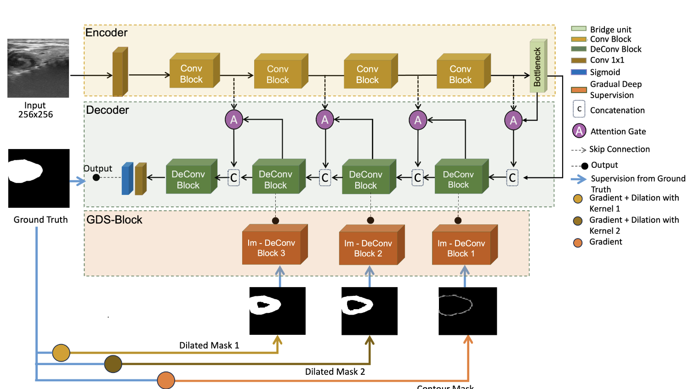
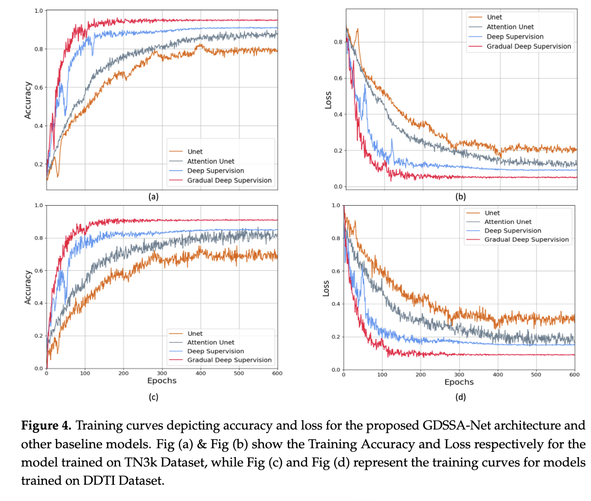
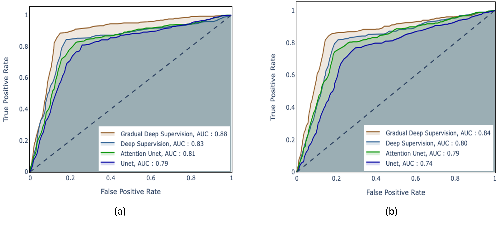

# Official Implementation of Deep Attentive & Edge Crafted Gradual Supervision 

Implementation of paper - [Title of Paper](https://arxiv.org/abs/2207.02696)

<!-- <a href="https://colab.research.google.com/gist/AlexeyAB/b769f5795e65fdab80086f6cb7940dae/yolov7detection.ipynb"></a> -->
<!-- [](https://arxiv.org/abs/2207.02696) -->

<div align="center">
    <a href="./">
        
    </a>
</div>

## Performance 
### Training Performance: 
<div align="center">
    <a href="./">
        
    </a>
</div>

### Testing Performance : 
<div align="center">
    <a href="./">
        
    </a>
</div>
## Installation

Conda environment (recommended)
<!-- <details><summary> <b>Expand</b> </summary> -->

``` shell
conda env create -f environment.yml
```

</details>

## Testing

[`yolov7.pt`](https://github.com/WongKinYiu/yolov7/releases/download/v0.1/yolov7.pt) [`yolov7x.pt`](https://github.com/WongKinYiu/yolov7/releases/download/v0.1/yolov7x.pt) [`yolov7-w6.pt`](https://github.com/WongKinYiu/yolov7/releases/download/v0.1/yolov7-w6.pt) [`yolov7-e6.pt`](https://github.com/WongKinYiu/yolov7/releases/download/v0.1/yolov7-e6.pt) [`yolov7-d6.pt`](https://github.com/WongKinYiu/yolov7/releases/download/v0.1/yolov7-d6.pt) [`yolov7-e6e.pt`](https://github.com/WongKinYiu/yolov7/releases/download/v0.1/yolov7-e6e.pt)

``` shell
python test.py --data data/coco.yaml --img 640 --batch 32 --conf 0.001 --iou 0.65 --device 0 --weights yolov7.pt --name yolov7_640_val
```

You will get the results:

```
 Average Precision  (AP) @[ IoU=0.50:0.95 | area=   all | maxDets=100 ] = 0.51206
 Average Precision  (AP) @[ IoU=0.50      | area=   all | maxDets=100 ] = 0.69730
 Average Precision  (AP) @[ IoU=0.75      | area=   all | maxDets=100 ] = 0.55521
 Average Precision  (AP) @[ IoU=0.50:0.95 | area= small | maxDets=100 ] = 0.35247
 Average Precision  (AP) @[ IoU=0.50:0.95 | area=medium | maxDets=100 ] = 0.55937
 Average Precision  (AP) @[ IoU=0.50:0.95 | area= large | maxDets=100 ] = 0.66693
 Average Recall     (AR) @[ IoU=0.50:0.95 | area=   all | maxDets=  1 ] = 0.38453
 Average Recall     (AR) @[ IoU=0.50:0.95 | area=   all | maxDets= 10 ] = 0.63765
 Average Recall     (AR) @[ IoU=0.50:0.95 | area=   all | maxDets=100 ] = 0.68772
 Average Recall     (AR) @[ IoU=0.50:0.95 | area= small | maxDets=100 ] = 0.53766
 Average Recall     (AR) @[ IoU=0.50:0.95 | area=medium | maxDets=100 ] = 0.73549
 Average Recall     (AR) @[ IoU=0.50:0.95 | area= large | maxDets=100 ] = 0.83868
```

## Training

Data preparation

``` shell
bash scripts/get_coco.sh
```

* Download MS COCO dataset images ([train](http://images.cocodataset.org/zips/train2017.zip), [val](http://images.cocodataset.org/zips/val2017.zip), [test](http://images.cocodataset.org/zips/test2017.zip)) and [labels](https://github.com/WongKinYiu/yolov7/releases/download/v0.1/coco2017labels-segments.zip). If you have previously used a different version of YOLO, we strongly recommend that you delete `train2017.cache` and `val2017.cache` files, and redownload [labels](https://github.com/WongKinYiu/yolov7/releases/download/v0.1/coco2017labels-segments.zip) 

Single GPU training

``` shell
# train p5 models
python train.py --workers 8 --device 0 --batch-size 32 --data data/coco.yaml --img 640 640 --cfg cfg/training/yolov7.yaml --weights '' --name yolov7 --hyp data/hyp.scratch.p5.yaml

# train p6 models
python train_aux.py --workers 8 --device 0 --batch-size 16 --data data/coco.yaml --img 1280 1280 --cfg cfg/training/yolov7-w6.yaml --weights '' --name yolov7-w6 --hyp data/hyp.scratch.p6.yaml
```


## Citation

```
@inproceedings{wang2023yolov7,
  title={{YOLOv7}: Trainable bag-of-freebies sets new state-of-the-art for real-time object detectors},
  author={Wang, Chien-Yao and Bochkovskiy, Alexey and Liao, Hong-Yuan Mark},
  booktitle={Proceedings of the IEEE/CVF Conference on Computer Vision and Pattern Recognition (CVPR)},
  year={2023}
}
```

```
@article{wang2023designing,
  title={Designing Network Design Strategies Through Gradient Path Analysis},
  author={Wang, Chien-Yao and Liao, Hong-Yuan Mark and Yeh, I-Hau},
  journal={Journal of Information Science and Engineering},
  year={2023}
}
```


## Example Visualizations

YOLOv7-semantic & YOLOv7-panoptic & YOLOv7-caption

<div align="center">
    <a href="./">
        
    </a>
    <a href="./">
        
    </a>
    <a href="./">
        
    </a>
    <a href="./">
        
    </a>
</div>

YOLOv7-semantic & YOLOv7-detection & YOLOv7-depth (with NTUT)

<div align="center">
    <a href="./">
        
    </a>
</div>

YOLOv7-3d-detection & YOLOv7-lidar & YOLOv7-road (with NTUT)

<div align="center">
    <a href="./">
        
    </a>
    <a href="./">
        
    </a>
    <a href="./">
        
    </a>
</div>


## Acknowledgements

<details><summary> <b>Expand</b> </summary>

* [https://github.com/AlexeyAB/darknet](https://github.com/AlexeyAB/darknet)
* [https://github.com/WongKinYiu/yolor](https://github.com/WongKinYiu/yolor)
* [https://github.com/WongKinYiu/PyTorch_YOLOv4](https://github.com/WongKinYiu/PyTorch_YOLOv4)
* [https://github.com/WongKinYiu/ScaledYOLOv4](https://github.com/WongKinYiu/ScaledYOLOv4)
* [https://github.com/Megvii-BaseDetection/YOLOX](https://github.com/Megvii-BaseDetection/YOLOX)
* [https://github.com/ultralytics/yolov3](https://github.com/ultralytics/yolov3)
* [https://github.com/ultralytics/yolov5](https://github.com/ultralytics/yolov5)
* [https://github.com/DingXiaoH/RepVGG](https://github.com/DingXiaoH/RepVGG)
* [https://github.com/JUGGHM/OREPA_CVPR2022](https://github.com/JUGGHM/OREPA_CVPR2022)
* [https://github.com/TexasInstruments/edgeai-yolov5/tree/yolo-pose](https://github.com/TexasInstruments/edgeai-yolov5/tree/yolo-pose)

</details>